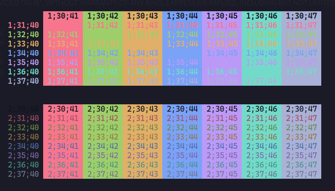
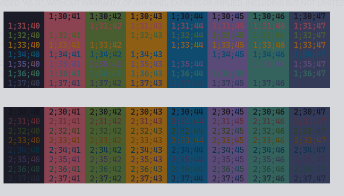
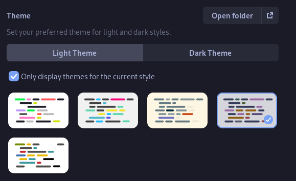

# tokyo-night-tilix-black-box-theme
tokyo night theme for Tilix/Black Box

to add these to BlackBox go to settings>terminal>theme>open folder and paste the .json files there

Black Box seems to use the same format as Tilix, so you can use any Tilix theme you like.

